# 🐳 Etape de realisation du Tutoriel Docker

Docker est un outil incontournable pour créer, déployer et exécuter des applications de manière rapide, portable et fiable.

---

## Objectifs du tutoriel
Dans ce tutoriel, nous allons effectuer les taches suivantes :
- Installer Docker
- Créer des images Docker
- Exécuter des conteneurs
- Gérer le stockage persistant
- Déployer des applications multi-conteneurs
- La mise en réseau Docker

Nous allons travailler dans un environnement ubuntu
---

## 1. Installation de Docker

### 🐧 Linux (Ubuntu)
Pour installer docker, nous allons utiliser les commandes suivantes:

```bash
sudo apt update
sudo apt install -y docker.io
sudo systemctl enable docker
sudo systemctl start docker
```

Vérification de l'installation effective de Docker:

```bash
docker --version
```
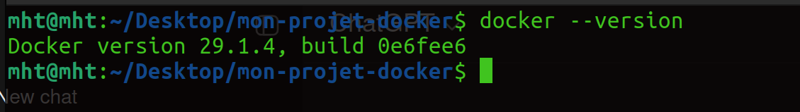


Pour utiliser Docker sans `sudo` (optionnel), il faut utiliser la commande suivante :

```bash
sudo usermod -aG docker $USER
newgrp docker
```
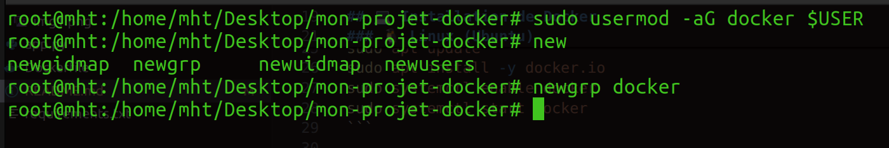

---

## 2. Concepts de base
Au cœur de Docker se trouvent les images qui servent de modèles pour les conteneurs ; les conteneurs qui sont les instances en cours d'exécution de ces images ; et le Docker Hub un référentiel centralisé pour le partage et la gestion des images.
### 📦 Images Docker
La commande suivante permet de telecharger l'image nginx
```bash
docker pull nginx
```
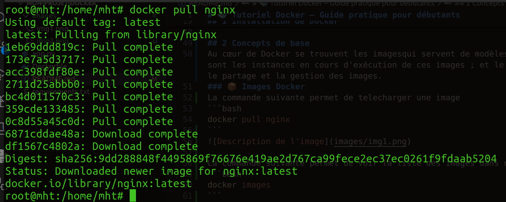

La commande suivante permet de voir la liste des images dans notre docker
```bash
docker images
```
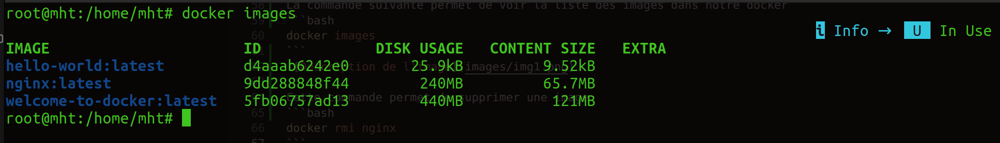

On peut également visualiser la liste des images directement sur Docker Desktop

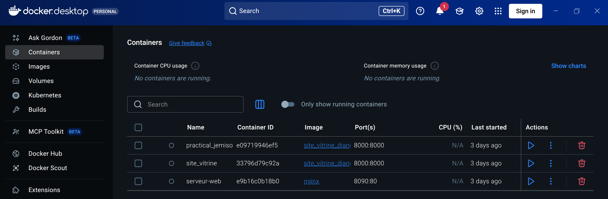

Cette commande permet de supprimer l'image nginx
```bash
docker rmi nginx
```

---

### ▶️ Conteneurs Docker
La commande suivante exécute un conteneur Nginx en mode détaché (en arrière-plan), en faisant correspondre le port 80 à l'intérieur du conteneur au port 8090 sur la machine hôte :
```bash
docker run -d -p 8090:80 nginx
```
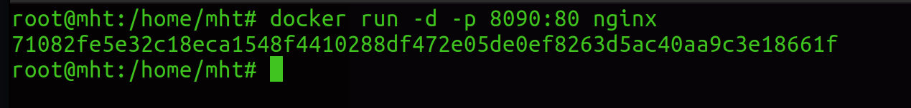

Pour vérifier tous les conteneurs en cours d'exécution et arrêtés :
```bash
docker ps -a
```
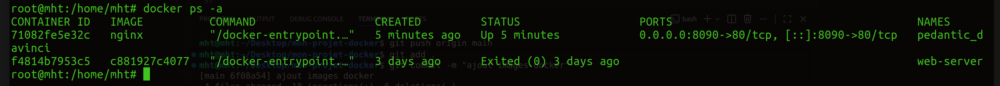

Pour arrêter un conteneur :
```bash
docker stop <container_id>
```
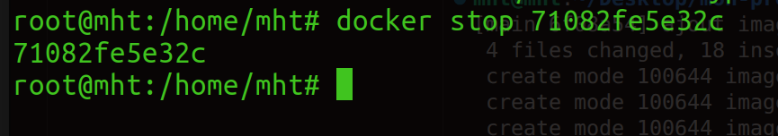

Pour supprimer un conteneur : 
```bash
docker rm <container_id>
```
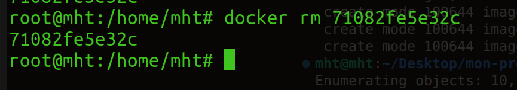
---

### 🌐 Docker Hub
Docker Hub est un service de registre basé sur le cloud qui permet de trouver, de stocker et de distribuer des images de conteneurs. Les utilisateurs peuvent envoyer des images personnalisées à Docker Hub et les partager publiquement ou en privé.

---

## 3. Premier conteneur

### Test installation
```bash
docker run hello-world
```
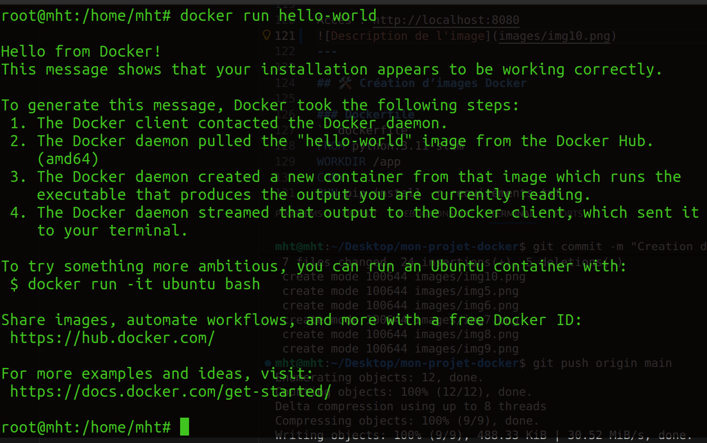

### Lancement du Serveur Nginx
```bash
docker run -d -p 8090:80 nginx
```
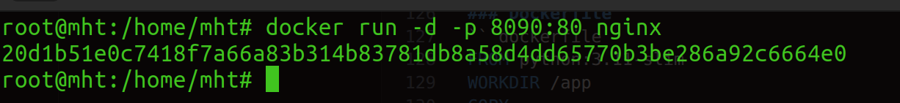

Accès au serveur nginx : http://localhost:8090
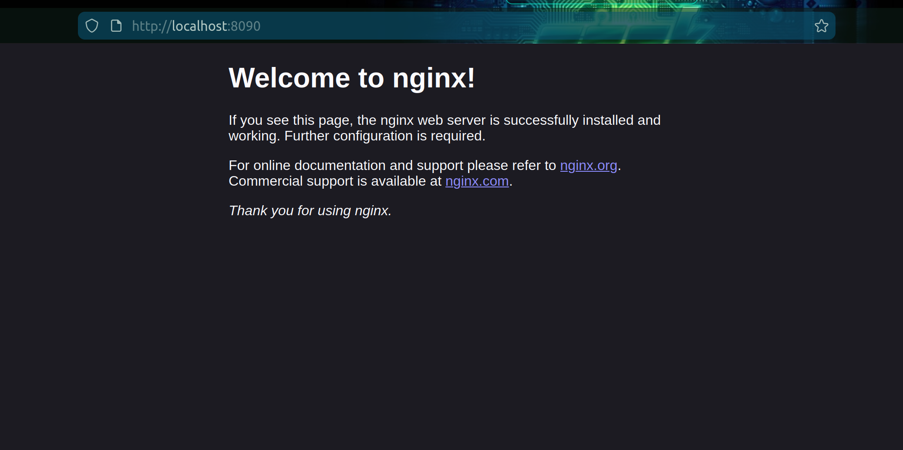
---

## 4. Création d’images Docker
La création d'une image Docker implique l'écriture d'un Dockerfile, un script qui automatise la construction d'une image

### Dockerfile
```dockerfile
FROM python:3.11-slim
WORKDIR /app
COPY . .
RUN pip install -r requirements.txt
CMD ["python", "app.py"]
```

### Build et Run
Pour construier une image, il faut utiliser la commande suivante :
```bash
docker build -t my-app .
```
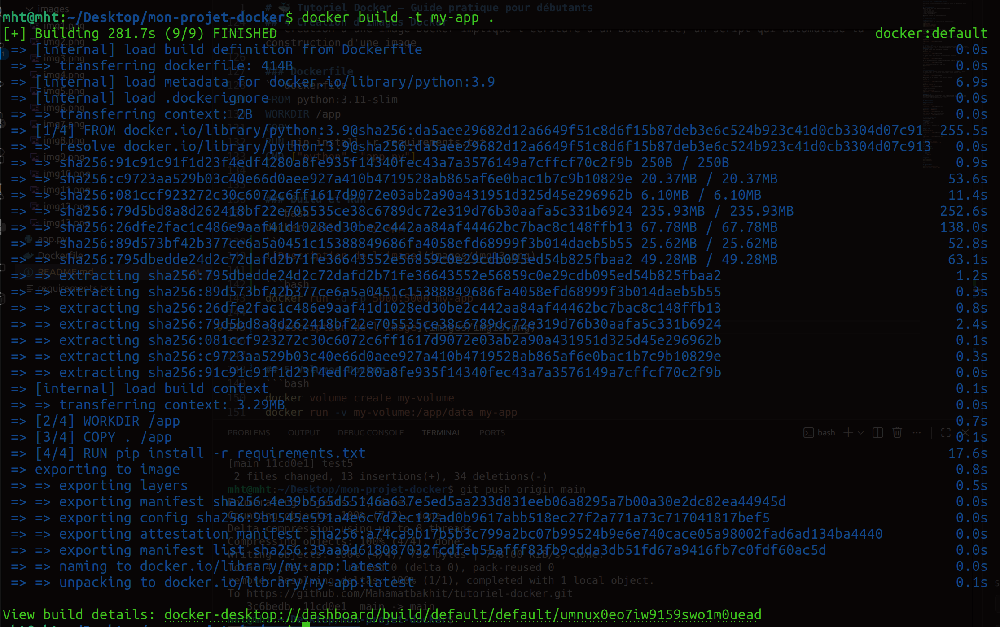
Pour executer notre image construite, nous allons utiliser la commande suivante : 
```bash
docker run -d -p 5000:5000 my-app
```
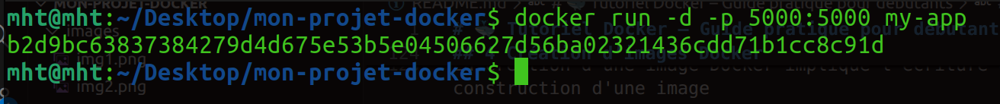
---

## 5. Volumes Docker
Pour conserver les données entre les redémarrages de conteneurs et les partager entre plusieurs conteneurs, Docker fournit des volumes, un mécanisme intégré pour gérer efficacement le stockage persistant.

Avant d'utiliser un volume, nous devons en créer un. Exécutez la commande suivante :
```bash
docker volume create my-volume
```
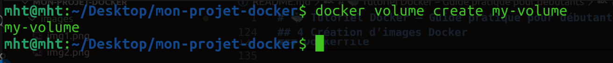

Maintenant, démarrons un conteneur et montons le volume à l'intérieur :

```bash
docker run -v my-volume:/app/data my-app
```
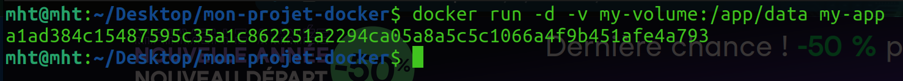
---

## 6. Docker Compose
Docker Compose est un outil qui simplifie la gestion des applications multi-conteneurs. 
### docker-compose.yml
Voici comment nous définissons notre configuration multi-conteneurs dans Docker Compose :
```yaml
version: "3.9"
services:
  web:
    image: nginx
    ports:
      - "8080:80"
```

### Commandes

Une fois que le fichier docker-compose.yml est prêt, nous pouvons lancer l'ensemble de la pile d'applications à l'aide d'une seule commande :

```bash
docker compose up -d
```
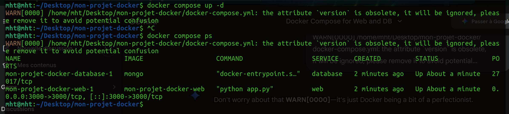

Pour arrêter tous les services, il faut utiliser la commande suivante :

```bash
docker compose down
```
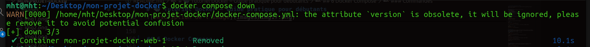

---

## 7. Réseaux Docker
Docker propose une gamme d'options de mise en réseau pour répondre à différents cas d'utilisation, des réseaux internes isolés aux configurations accessibles à l'extérieur.

Avant d'exécuter des conteneurs, nous devons d'abord créer un réseau dédié :
```bash
docker network create my-custom-network
```


Démarrons maintenant deux conteneurs et connectons-les à notre réseau nouvellement créé :
```bash
docker run -d --network my-custom-network --name app1 my-app
docker run -d --network my-custom-network --name app2 my-app
```
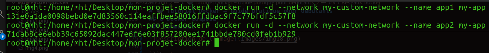
---
